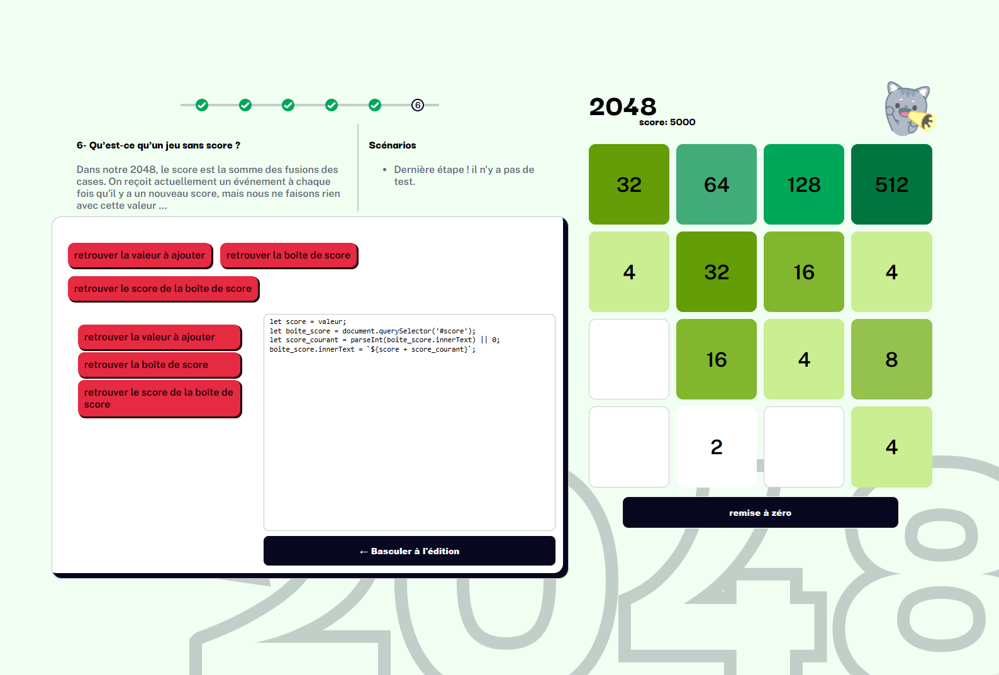

# Atelier éducatif : Programmation du jeu 2048

Dans le cadre d'une visite d'élèves de secondaire 1 à l'Université de Sherbrooke, un atelier d'une heure a été conçu pour initier les élèves à la programmation informatique. L'objectif était d'utiliser une interface visuelle combinant blocs logiques et code pour terminer la programmation du jeu 2048. Voici un guide étape par étape pour le solutionnaire de cet atelier, avec des explications pédagogiques pour chaque partie.



## Étape 1 : Comprendre le fonctionnement

Avant de commencer la programmation, il est important de présenter la plateforme et le but de l'atelier. Une fois les explications données, les blocs et l'ordre est données par la personnes qui présente.

Bloc à utiliser
```
+-------------------------------------------------+
| J'ai très bien compris                          |
+-------------------------------------------------+
| J'ai attendu que les explications soient finies |
+-------------------------------------------------+
```


## Étape 2 : Faire glisser les blocs vers la gauche

L'objectif de cette étape est d'ajouter la logique qui permet au jeu de déplacer les blocs lorsqu'on effectue un mouvement vers la gauche.

### Logique de haut niveau

Pour faire glisser les blocs vers la gauche:
1. Pour chaque rangée de blocs, les déplacer vers la gauche.

Bloc à utiliser
```
+---------------+
| pour toutes   |
+---------------+
| rangées       |
+---------------+
| faire glisser |
+---------------+
| fin           |
+---------------+
```

Cette étape introduit la notion de boucle et permet aux élèves de comprendre comment itérer sur chaque rangée du jeu. Cela sera utile pour les étapes suivantes. 


## Étape 3 : Faire glisser les blocs vers la droite

Cette étape ressemble à la précédente, mais les élèves doivent faire glisser les blocs vers la droite. La difficulté réside dans le fait que le glissement vers la droite n'est pas direct, il faut inverser la liste des éléments avant de les déplacer.

### Problème (mener les élèves à avoir cette réflexion)
1. Si l'on glisse les éléments vers la gauche dans une liste inversée, cela donne l'effet attendu d'un déplacement vers la droite dans la liste originale.


Bloc à utiliser
```
+-------------------------------------+
| pour toutes                         |       for (const groupe of rangees) {
+-------------------------------------+
| rangées                             |
+-------------------------------------+
| pour tout décroissant               |           for (let i = longueur(groupe); i > 0; i = i - 1) {
+-------------------------------------+
| rangée                              |
+-------------------------------------+
| Ajouter le ième élément à la liste  |               liste.push(groupe[i]);
+-------------------------------------+           
| fin                                 |           }
+-------------------------------------+
| faire glisser                       |           faire_glisser(groupe);
+-------------------------------------+
| fin                                 |       }
+-------------------------------------+
```

Le code généré par les blocs n'est pas fonctionnel, il faut donc basculer en mode édition pour corriger certains soucis;
1. la variable liste n'existe pas.
2. on voudrait faire glisser la liste représentat une rangée inversée.
3. En observant les condition de la boucle for, on voit que l'on ne manipule pas le bon indice (4 - 3 - 2 -1) au lieu de (3 - 2 - 1 - 0).

Code final:
```
for (const groupe of rangees) {
  const liste = [];
  for (let i = longueur(groupe); i > 0; i = i - 1) {
    liste.push(groupe[i - 1]);
  }
  faire_glisser(liste);
}
```


## Étape 4 : Appliquer la même logique aux colonnes

L'idée est de faire glisser les blocs vers le haut ou vers le bas, en utilisant la même logique que pour les rangées, mais appliquée cette fois-ci aux colonnes. En regardant le code fait à l'étape 3, on peut réaliser 
que la seule différence est la variable dans la première boucle for `rangees` qui lie ce sur quoi on travail.

Code final:
```
for (const groupe of colonnes) {
  const liste = [];
  for (let i = longueur(groupe); i > 0; i = i - 1) {
    liste.push(groupe[i - 1]);
  }
  faire_glisser(liste);
}
```

Cette étape encourage les élèves à appliquer un raisonnement similaire pour un problème légèrement différent, renforçant ainsi leur compréhension de la logique répétitive et des boucles.


## Étape 5 : Ajouter de la couleur en fonction des valeurs

Pour rendre le jeu visuellement attractif, chaque case doit avoir une couleur qui dépend de sa valeur. Les élèves doivent comprendre comment associer des valeurs spécifiques à des couleurs.

Bloc à utiliser
```
+------------------------------------------------+
| retrouver liste couleurs                       |  let couleurs = ['#FFFFFF', '#CAEE91', '#95C14E', '#82B62F', 
+------------------------------------------------+     '#649D07', '#41AC7A', '#00A759', '#008F4C', '#00753F', '#005C31', '#004223'];
| si                                             |  if (valeur == 8) {
+------------------------------------------------+
| valeur du bloc égal 3                          |
+------------------------------------------------+
| la couleur de la case est la troisième couleur |      couleur_de_la_case = couleurs[2];
+------------------------------------------------+
| fin                                            |  }
+------------------------------------------------+
```

Ensuite, faire l'ensemble des assignations conditionnelles pour chaque puissace de 2 de 2 à 2048.

Code final:
```
let couleurs = ['#FFFFFF', '#CAEE91', '#95C14E', '#82B62F',
 '#649D07', '#41AC7A', '#00A759', '#008F4C',
 '#00753F', '#005C31', '#004223'];

if (valeur == 2) { couleur_de_la_case = couleurs[0]; }
if (valeur == 4) { couleur_de_la_case = couleurs[1]; }
if (valeur == 8) { couleur_de_la_case = couleurs[2]; }
if (valeur == 16) { couleur_de_la_case = couleurs[3]; }
if (valeur == 32) { couleur_de_la_case = couleurs[4]; }
if (valeur == 64) { couleur_de_la_case = couleurs[5]; }
if (valeur == 128) { couleur_de_la_case = couleurs[6]; }
if (valeur == 256) { couleur_de_la_case = couleurs[7]; }
if (valeur == 512) { couleur_de_la_case = couleurs[8]; }
if (valeur == 1024) { couleur_de_la_case = couleurs[9]; }
if (valeur == 2048) { couleur_de_la_case = couleurs[10]; }
```

Cette partie aide les élèves à comprendre comment utiliser des conditions pour associer des données (ici des couleurs) en fonction de valeurs spécifiques.


# Étape 6 : Calculer le score

Partie supplémentaire, permettant aux élèves d'avoir un jeu affichant leur score. Cette partie n'a pas de réel objetcif d'apprentissage outre le fait d'avoir la satisfaction des élèves.

Code final:
```
let score = valeur;
let boite_score = document.querySelector('#score');
let score_courant = parseInt(boite_score.innerText) || 0;
boite_score.innerText = `${score + score_courant}`;
```

